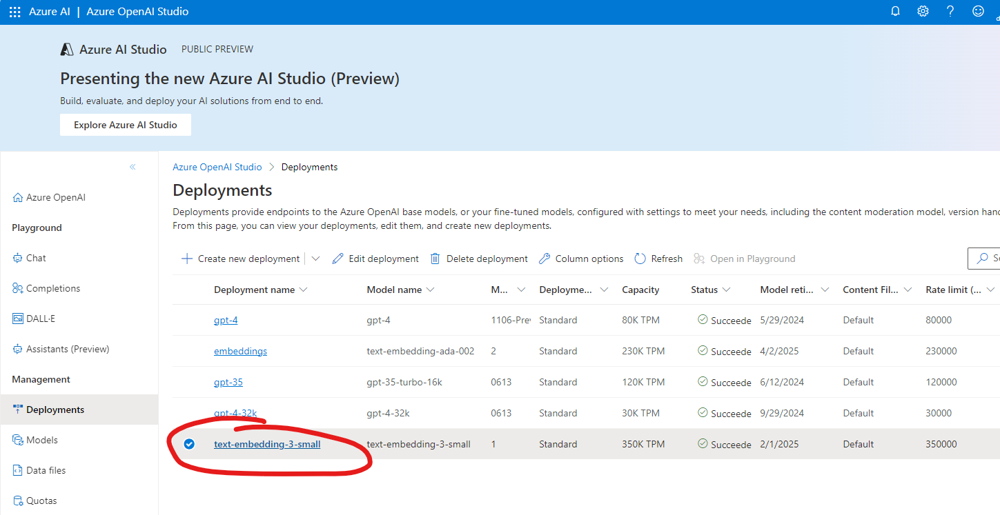

# Get Embeddings from OpenAI from Azure SQL

In this sample you'll be creating a stored procedure to easily transform text into a vector using OpenAI embedding model.

## Create the Embedding Model

Make sure you can access OpenAI service by following the documentation here: [How do I get access to Azure OpenAI?](https://learn.microsoft.com/azure/ai-services/openai/overview#how-do-i-get-access-to-azure-openai).

Deploy an embedding model - for example the `text-embedding-ada-002` - following the [Create and deploy an Azure OpenAI Service resource](https://learn.microsoft.com/azure/ai-services/openai/how-to/create-resource)

Then retrieve the Azure OpenAI *endpoint* and *key*:


## Store the credentials into Azure SQL

Connect to Azure SQL database and run the `01-store-openai-credentials.sql` to store the Azure OpenAI endpoint and secret so that it can be used for later use.  

## Create the `get_embeddings` Stored Procedure

Use the `02-create-get-embeddings-procedure.sql` to create a stored procedure that will call the OpenAI embedding model you have deployed before. The stored procedure uses the [`sp_invoke_external_rest_endpoint`](https://learn.microsoft.com/sql/relational-databases/system-stored-procedures/sp-invoke-external-rest-endpoint-transact-sql) 

## Transform text into embedding

Use the `03-get-embeddings.sql` to call to OpenAI to transform sample text into embeddings. Make sure to use the deployed model *name*:



And then use 

```sql
declare @king varbinary(8000);
exec dbo.get_embedding @deployedModelName = 'text-embedding-3-small', @inputText = 'King', @embedding = @king output;
```

the resulting vector will be stored into the `@king` variable.
You can now compare it with another variable to find how similar they are:

```sql
select
    vector_distance('cosine', @king, @queen) as 'King vs Queen'
```