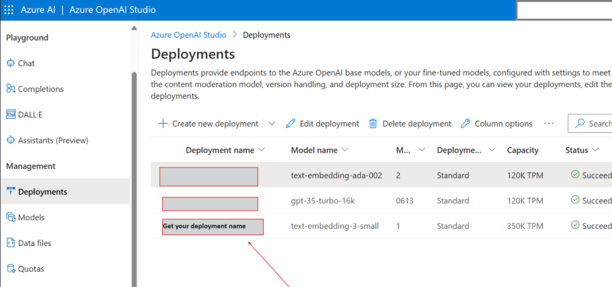
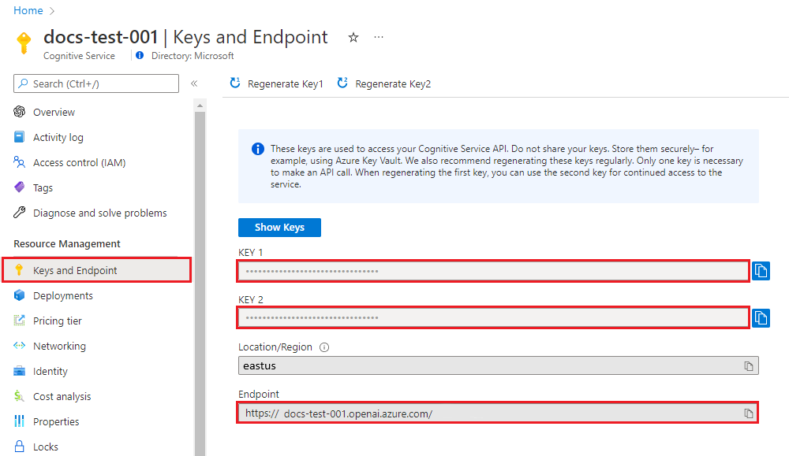

# Create, Store, and Query OpenAI Embeddings in Azure SQL DB

Learn how to integrate Azure OpenAI API with Azure SQL DB to create, store, and query embeddings for advanced similarity searches and LLM generation augmentation.

## Tutorial Overview

This Python [notebook](EmbeddingsWithSQL.ipynb) will teach you to:

- **Create Embeddings**: Generate embeddings from content using the Azure OpenAI API.
- **Vector Database Utilization**: Use Azure SQL DB to store embeddings and perform similarity searches.
- **LLM Generation Augmentation**: Enhance language model generation with embeddings from a vector database. In this case we use the embeddings to inform a GPT-4 chat model, enabling it to provide rich, context-aware answers about products based on past customer reviews.

## Dataset

We use the Fine Foods Review Dataset from Kaggle, which contains Amazon reviews of fine foods. 

- For simplicity, this tutorial uses a smaller sample [Fine Foods Review Dataset](../Datasets/Reviews.csv) to demonstrate embedding generation. 
- Alternatively, if **you to wish bypass embedding generation** and jump straight to similarity search in SQLDB. you can download the pre-generated [FineFoodEmbeddings.csv](../Datasets/FineFoodEmbeddings.csv) 

## Prerequisites

- **Azure Subscription**: [Create one for free](https:\azure.microsoft.com\free\cognitive-services?azure-portal=true)
- **Azure SQL Database**: [Set up your database for free](https:\learn.microsoft.com\azure\azure-sql\database\free-offer?view=azuresql)
- **Azure Data Studio**: Download [here](https://azure.microsoft.com/products/data-studio) to manage your Azure SQL database and [execute the notebook](https://learn.microsoft.com/azure-data-studio/notebooks/notebooks-python-kernel)

## Additional Requirements for Embedding Generation

- **Azure OpenAI Access**: Apply for access in the desired Azure subscription at [https://aka.ms/oai/access](https:\aka.ms\oai\access)
- **Azure OpenAI Resource**: Deploy an embeddings model (e.g., `text-embedding-small` or `text-embedding-ada-002`) and a `GPT-4` model for chat completion. Refer to the [resource deployment guide](https:\learn.microsoft.com\azure\ai-services\openai\how-to\create-resource)
- **Python**: Version 3.7.1 or later from Python.org.
- **Python Libraries**: Install the required libraries openai, num2words, matplotlib, plotly, scipy, scikit-learn, pandas, tiktoken, and pyodbc.
- **Jupyter Notebooks**: Use within [Azure Data Studio](https:\learn.microsoft.com\en-us\azure-data-studio\notebooks\notebooks-guidance) or Visual Studio Code .

Code snippets are adapted from the [Azure OpenAI Service embeddings Tutorial](https://learn.microsoft.com/en-us/azure/ai-services/openai/tutorials/embeddings?tabs=python-new%2Ccommand-line&pivots=programming-language-python)

## Getting Started

1. **Database Setup**: Execute SQL commands from the `createtable.sql` script to create the necessary table in your database.
2. **Model Deployment**: Deploy an embeddings model (`text-embedding-small` or `text-embedding-ada-002`) and a `GPT-4` model for chat completion. Note the 2 model deployment names for later use.

3. **Connection String**: Find your Azure SQL DB connection string in the Azure portal under your database settings.
4. **Configuration**: Populate the `.env` file with your SQL server connection details , Azure OpenAI key, and endpoint values. 

You can retrieve the Azure OpenAI *endpoint* and *key*:

## Running the Notebook

To [execute the notebook](https://learn.microsoft.com/azure-data-studio/notebooks/notebooks-python-kernel), connect to your Azure SQL database using Azure Data Studio, which can be downloaded [here](https://azure.microsoft.com/products/data-studio). 

Then open the notebook [RetrievalAugmentedGeneration.ipynb](./RetrievalAugmentedGeneration.ipynb)
