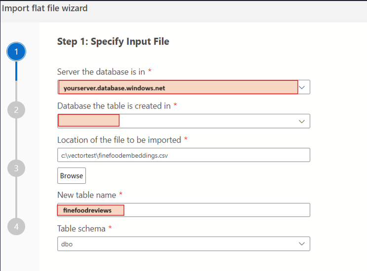
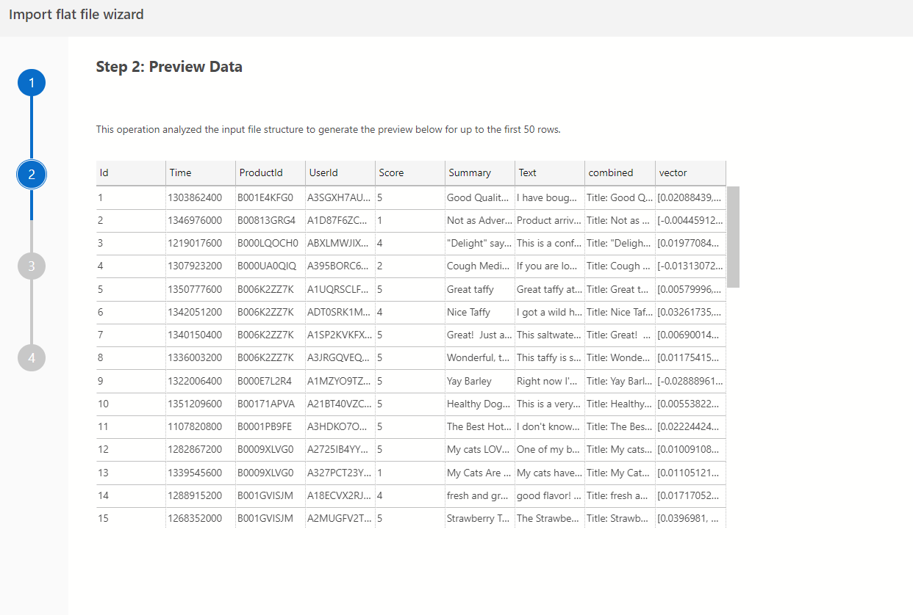
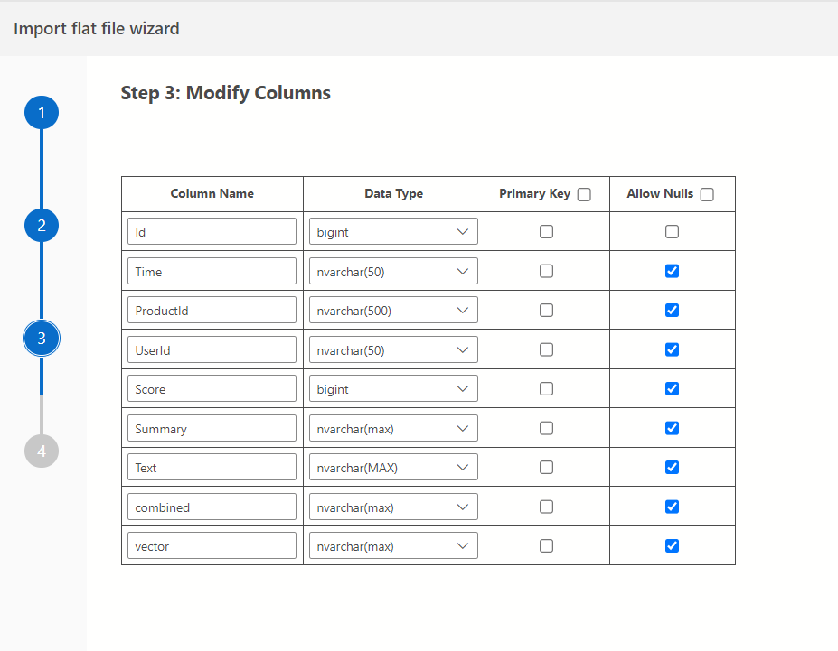
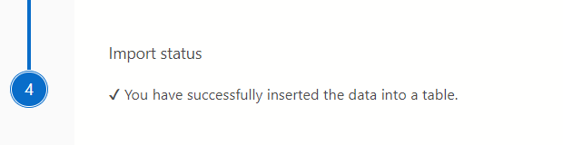

# Store and Query OpenAI Embeddings in Azure SQL DB (T-SQL)

## Vector Similarity Search in SQL DB

Learn how to store and query vector embeddings in Azure SQL Database using T-SQL with this step-by-step tutorial.

# Dataset

- For this tutorial we use the sample data [finefoodembeddings.csv](https://github.com/Azure-Samples/azure-sql-db-vector-search/blob/a181e15337402e568f4fc66fe5941e5973171972/VectorSearch_Notebooks/Datasets/finefoodembeddings.csv) The dataset has been created using the customer reviews from FineFoods Amazon and enriching it with embeddings generated via the `text-embedding-small` Azure OpenAI model.
The embeddings have been generated using the concatenation of Product summary and Customer Reviews (Summary + Text)

# Prerequisites

- **Azure Subscription**: [Create one for free](https:\azure.microsoft.com\free\cognitive-services?azure-portal=true)
- **Azure SQL Database**: [Set up your database for free](https:\learn.microsoft.com\azure\azure-sql\database\free-offer?view=azuresql)
- **Azure Data Studio**: Download [here](https://azure.microsoft.com/products/data-studio) and run the notebook using [SQL Kernel for Notebooks in Azure Data Studio](https://learn.microsoft.com/azure-data-studio/notebooks/notebooks-guidance#connect-to-a-kernel). 

- **Azure OpenAI Access**: Make sure you can access OpenAI service by following the documentation here: [How do I get access to Azure OpenAI?](https://learn.microsoft.com/azure/ai-services/openai/overview#how-do-i-get-access-to-azure-openai)

- **Azure OpenAI Resource**: Deploy an embeddings model (e.g., `text-embedding-small` or `text-embedding-ada-002`) following the steps in [Create and deploy an Azure OpenAI Service resource](https://learn.microsoft.com/azure/ai-services/openai/how-to/create-resource)

- For this specific sample you have to deploy an embeddings model `text-embedding-small`  model, the same used for the source we are using in this sample. 
Once that is done, you need to get the API KEY and the URL of the deployed model  [Embeddings REST API](https:\learn.microsoft.com\azure\cognitive-services\openai\reference#embeddings). 

Then retrieve the Azure OpenAI *endpoint* and *key*:

Then retrieve the deployed model *name* from Azure OpenAI Studio

In the notebook we will [`sp_invoke_external_rest_endpoint`](https://learn.microsoft.com/sql/relational-databases/system-stored-procedures/sp-invoke-external-rest-endpoint-transact-sql) that will call the OpenAI embedding model you have deployed before

# Importing Data into SQL DB

Import the data into the `finefoodreviews` table by following these steps:
1. Utilize the [SQL Server Import extension](https:\learn.microsoft.com\azure-data-studio\extensions\sql-server-import-extension) in Azure Data Studio to convert `.txt` and `.csv` files into a SQL table.
2. Step by Step instructions are available [here](https:\learn.microsoft.com\azure-data-studio\extensions\sql-server-import-extension)

You can see the preview of the data you will be importing

Make sure to modify the data types accordingly before the import process

- **Id**: `bigint` NOT NULL
- **ProductId**: `nvarchar(500)` NULL
- **UserId**: `nvarchar(50)` NULL
- **Time**: `nvarchar` NULL
- **Score**: `bigint` NULL
- **Summary**: `nvarchar` NULL
- **Text**: `nvarchar` NULL
- **Combined**: `nvarchar` NULL
- **Vector**: `varchar(max)` NULL

Once you have successfully inserted the data, we can now try our new Vector functions

# Running the Notebook

Execute the notebook using the [SQL Kernel for Notebooks in Azure Data Studio](https://learn.microsoft.com/azure-data-studio/notebooks/notebooks-guidance#connect-to-a-kernel). 
